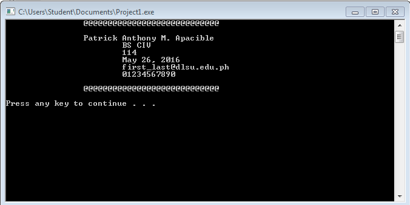

# Activity1-ApacibleP
```
#include <stdio.h>
#include <stdlib.h>


int main() 
{
	printf("\t\t@@@@@@@@@@@@@@@@@@@@@@@@@@@@\n\n");
	printf("\t\tPatrick Anthony M. Apacible\n");
	printf("\t\t\tBS CIV\n");
	printf("\t\t\t114\n");
	printf("\t\t\tMay 26, 2016\n");
	printf("\t\t\tfirst_last@dlsu.edu.ph\n");
	printf("\t\t\t01234567890\n\n");
	printf("\t\t@@@@@@@@@@@@@@@@@@@@@@@@@@@@\n\n");
			return 0;
		
}
```

