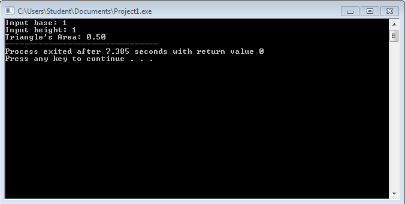
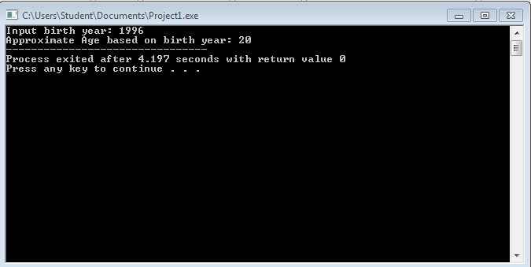

# Activity1-ApacibleP
```
#include <stdio.h>
#include <stdlib.h>


int main() 
{
	printf("\t\t@@@@@@@@@@@@@@@@@@@@@@@@@@@@\n\n");
	printf("\t\tPatrick Anthony M. Apacible\n");
	printf("\t\t\tBS CIV\n");
	printf("\t\t\t114\n");
	printf("\t\t\tMay 26, 2016\n");
	printf("\t\t\tfirst_last@dlsu.edu.ph\n");
	printf("\t\t\t01234567890\n\n");
	printf("\t\t@@@@@@@@@@@@@@@@@@@@@@@@@@@@\n\n");
			return 0;
		
}
```


```
#include <stdio.h>
#include <stdlib.h>


int main() 
{
	float b,h,a;
	printf("Input base: ");
	scanf("%f", &b);
	printf("Input height: ");
	scanf("%f", &h);
	a=b*h*1/2;
	printf("Triangle's Area: %.2f", a);
	system("PAUSE");
	return 0;
}
```


```
#include <stdio.h>
#include <stdlib.h>


int main() 
{
	int b,a;
	printf("Input birth year: ");
	scanf("%d", &b);	
	a=2016-b;
	printf("Approximate Age based on birth year: %d\n", a);
	system("PAUSE");
	return 0;
		
}
```

